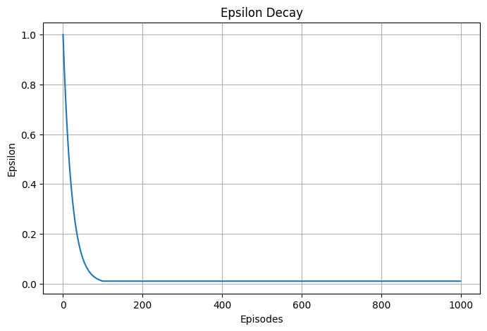
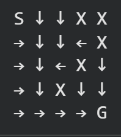

# Reinforcement-Learning-GridWorld

## 📌 Project Overview

This project implements the **Q-Learning algorithm from scratch** to solve a custom **GridWorld environment**.  
An agent learns to navigate from a **start position to a goal** while avoiding obstacles using reinforcement learning.

The agent improves over time using **trial-and-error learning**, guided by rewards and penalties.

---

## 🎯 Objective

- Reach the goal state in the shortest path possible
- Avoid obstacles and invalid moves
- Learn an optimal policy using Q-learning

---

## 🧱 Environment Description

- Grid Size: 5 × 5 (customizable)
- Start Position: (0, 0)
- Goal Position: (n-1, n-1)
- Obstacles: Randomly generated
- Actions:
  - 0 → Up
  - 1 → Down
  - 2 → Left
  - 3 → Right

---

## 🧠 Algorithm Used

### Q-Learning

The agent updates its knowledge using the formula:

\[
Q(s,a) = Q(s,a) + \alpha \left[r + \gamma \max Q(s',a') - Q(s,a)\right]
\]

Where:
- α = Learning rate  
- γ = Discount factor  
- r = Reward  
- Q(s,a) = Q-value for state-action pair  

---

## ⚙️ Hyperparameters

| Parameter | Value |
|-----------|------:|
| Learning Rate (α) | 0.1 |
| Discount Factor (γ) | 0.9 |
| Initial Epsilon | 1.0 |
| Epsilon Decay | 0.955 |
| Minimum Epsilon | 0.01 |
| Episodes | 1000 |

---

## 📊 Results

The agent successfully learns an optimal policy over time.

### Episode Rewards


### Epsilon Decay


### Learned Policy


### Final Path


---
## 🧪 How to Run

Install dependencies:

```bash
pip install numpy matplotlib
```

Run the notebook:

```bash
jupyter notebook q_learning_gridworld.ipynb
```

Or open it in **Google Colab**:
- Upload the `.ipynb` file to Colab
- Run all cells

---

## 📌 Note

If running locally:
- Make sure Python 3.x is installed
- Install required libraries before running the notebook
  
## 📌 Key Learnings
How Q-learning updates work in practice
Exploration vs exploitation trade-off (ε-greedy policy)
Importance of reward design
How agents learn optimal paths without explicit instructions

## 🚀 Future Improvements
Add different reward structures
Implement SARSA algorithm
Use larger grids (10×10, 20×20)
Visual animation of agent movement
Compare Q-learning vs Deep Q-learning

## 👨‍💻 Author

Your Name
GitHub: https://github.com/ShreyaM5

⭐ If you like this project
Give it a ⭐ on GitHub and feel free to fork it!
